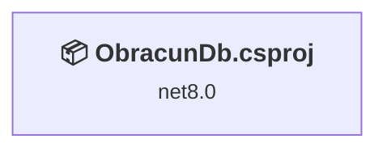
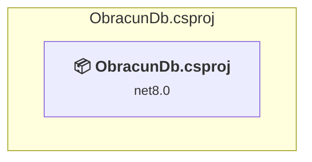

# Projects and dependencies analysis

This document provides a comprehensive overview of the projects and their dependencies in the context of upgrading to .NETCoreApp,Version=v10.0.

## Table of Contents

- [Executive Summary](#executive-Summary)
  - [Highlevel Metrics](#highlevel-metrics)
  - [Projects Compatibility](#projects-compatibility)
  - [Package Compatibility](#package-compatibility)
  - [API Compatibility](#api-compatibility)
  - [Binding Redirect Configuration](#binding-redirect-configuration)
- [Aggregate NuGet packages details](#aggregate-nuget-packages-details)
- [Top API Migration Challenges](#top-api-migration-challenges)
  - [Technologies and Features](#technologies-and-features)
  - [Most Frequent API Issues](#most-frequent-api-issues)
- [Projects Relationship Graph](#projects-relationship-graph)
- [Project Details](#project-details)

  - [ObracunDb.csproj](#obracundbcsproj)

## Executive Summary

### Highlevel Metrics

| Metric | Count | Status |
| :--- | :---: | :--- |
| Total Projects | 1 | All require upgrade |
| Total NuGet Packages | 8 | 1 need upgrade |
| Total Code Files | 107 |  |
| Total Code Files with Incidents | 10 |  |
| Total Lines of Code | 16503 |  |
| Total Number of Issues | 36 |  |
| Estimated LOC to modify | 34+ | at least 0,2% of codebase |

### Projects Compatibility

| Project | Target Framework | Difficulty | Package Issues | API Issues | Binding Issues | Est. LOC Impact | Description |
| :--- | :---: | :---: | :---: | :---: | :---: | :---: | :--- |
| [ObracunDb.csproj](#obracundbcsproj) | net8.0 | 🟢 Low | 1 | 34 | 0 | 34+ | AspNetCore, Sdk Style = True |

### Package Compatibility

| Status | Count | Percentage |
| :--- | :---: | :---: |
| ✅ Compatible | 7 | 87,5% |
| ⚠️ Incompatible | 0 | 0,0% |
| 🔄 Upgrade Recommended | 1 | 12,5% |
| ***Total NuGet Packages*** | ***8*** | ***100%*** |

### API Compatibility

| Category | Count | Impact |
| :--- | :---: | :--- |
| 🔴 Binary Incompatible | 0 | High - Require code changes |
| 🟡 Source Incompatible | 9 | Medium - Needs re-compilation and potential conflicting API error fixing |
| 🔵 Behavioral change | 25 | Low - Behavioral changes that may require testing at runtime |
| ✅ Compatible | 71829 |  |
| ***Total APIs Analyzed*** | ***71863*** |  |

## Aggregate NuGet packages details

| Package | Current Version | Suggested Version | Projects | Description |
| :--- | :---: | :---: | :--- | :--- |
| ClosedXML | 0.104.2 |  | [ObracunDb.csproj](#obracundbcsproj) | ✅Compatible |
| DevExpress.Blazor | 25.2.* |  | [ObracunDb.csproj](#obracundbcsproj) | ✅Compatible |
| DevExpress.Blazor.PdfViewer | 25.2.* |  | [ObracunDb.csproj](#obracundbcsproj) | ✅Compatible |
| DevExpress.Blazor.PivotTable | 25.2.* |  | [ObracunDb.csproj](#obracundbcsproj) | ✅Compatible |
| DevExpress.Pdf.SkiaRenderer | 25.2.* |  | [ObracunDb.csproj](#obracundbcsproj) | ✅Compatible |
| FirebirdSql.Data.FirebirdClient | 10.3.4 |  | [ObracunDb.csproj](#obracundbcsproj) | ✅Compatible |
| linq2db | 6.1.0 |  | [ObracunDb.csproj](#obracundbcsproj) | ✅Compatible |
| Microsoft.Extensions.Hosting.WindowsServices | 8.0.1 | 10.0.10 | [ObracunDb.csproj](#obracundbcsproj) | NuGet package upgrade is recommended |

## Top API Migration Challenges

### Technologies and Features

| Technology | Issues | Percentage | Migration Path |
| :--- | :---: | :---: | :--- |

### Most Frequent API Issues

| API | Count | Percentage | Category |
| :--- | :---: | :---: | :--- |
| T:System.Text.Json.JsonDocument | 12 | 35,3% | Behavioral Change |
| T:System.Net.Http.HttpContent | 6 | 17,6% | Behavioral Change |
| M:System.TimeSpan.FromHours(System.Double) | 4 | 11,8% | Source Incompatible |
| T:System.Uri | 3 | 8,8% | Behavioral Change |
| M:System.Uri.#ctor(System.String) | 3 | 8,8% | Behavioral Change |
| M:System.TimeSpan.FromSeconds(System.Double) | 3 | 8,8% | Source Incompatible |
| M:System.TimeSpan.FromDays(System.Double) | 2 | 5,9% | Source Incompatible |
| M:Microsoft.AspNetCore.Builder.ExceptionHandlerExtensions.UseExceptionHandler(Microsoft.AspNetCore.Builder.IApplicationBuilder,System.String,System.Boolean) | 1 | 2,9% | Behavioral Change |

## Projects Relationship Graph

Legend:
📦 SDK-style project
⚙️ Classic project

## Project Details

### ObracunDb.csproj

#### Project Info

- **Current Target Framework:** net8.0
- **Proposed Target Framework:** net10.0
- **SDK-style**: True
- **Project Kind:** AspNetCore
- **Dependencies**: 0
- **Dependants**: 0
- **Number of Files**: 183
- **Number of Files with Incidents**: 10
- **Lines of Code**: 16503
- **Estimated LOC to modify**: 34+ (at least 0,2% of the project)

#### Dependency Graph

Legend:
📦 SDK-style project
⚙️ Classic project

### API Compatibility

| Category | Count | Impact |
| :--- | :---: | :--- |
| 🔴 Binary Incompatible | 0 | High - Require code changes |
| 🟡 Source Incompatible | 9 | Medium - Needs re-compilation and potential conflicting API error fixing |
| 🔵 Behavioral change | 25 | Low - Behavioral changes that may require testing at runtime |
| ✅ Compatible | 71829 |  |
| ***Total APIs Analyzed*** | ***71863*** |  |

